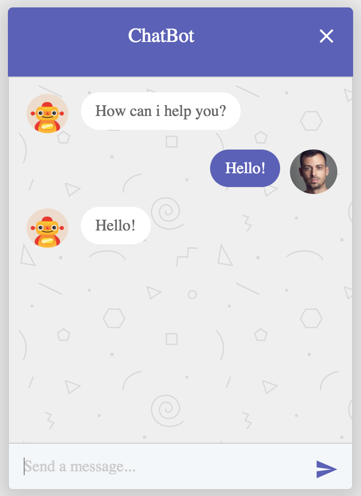

BOT UI
======

Simple Bot UI

> Click on image to see **Demo**

[](https://xmlking.github.io/sumo.ai/bot-ui/dist/index.html)

### Setup
```bash
cd bot-ui
npm i
```

### Build
```bash
cd bot-ui
# clean dist
npm run clean
# dev build
npm run build
# prod build
npm run build:prod
```

### Run
```bash
cd bot-ui
npm start
Browse to http://localhost:3000/
```

### Integration

copy `dist/*` to host project and integrate UI Widget into target html page.

### Test
open `index.html` file in `IntelliJ` and click chrome icon in the top right corner.

>  test API
```
https://httpbin.org/get?echo=I am bot
```

### Credit
* https://codepen.io/shivapandey/pen/dWdRYM

